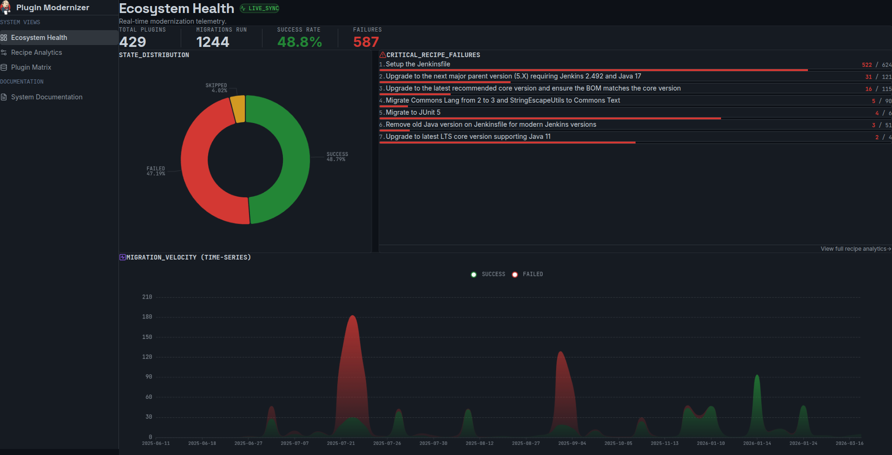

# 🚀 Jenkins Plugin Modernizer: Telemetry Command Center

**[🔴 View Live Interactive Dashboard](https://aqeell7.github.io/jenkins-modernizer-stats/)**

 *(Note: Replace this path with a high-res screenshot of your Ecosystem Health page!)*

## 📖 Overview

The **Plugin Modernizer Telemetry Dashboard** is an enterprise-grade, zero-latency analytics platform designed for Jenkins core maintainers. It provides real-time visibility into the automated modernization of over 400+ Jenkins plugins via OpenRewrite recipes.

Instead of hunting through raw CI/CD logs or dealing with sluggish, API-rate-limited dashboards, this tool provides instantaneous, actionable intelligence to help maintainers track ecosystem health, identify failing migrations, and prioritize developer interventions.

## ✨ Key Features

* **⚡ Zero-API Architecture:** Bypasses GitHub API rate limits entirely by utilizing a local file-system aggregation engine during the CI/CD build phase.
* **📊 Ecosystem Telemetry:** Real-time tracking of total migrations, success rates, and time-series migration velocity using Apache ECharts.
* **🔍 Deep-Dive Drill-Downs:** Spacious, Vercel-style slide-out panels allow maintainers to inspect specific plugin execution logs or view every plugin affected by a specific failing recipe.
* **🎯 Actionable Intelligence:** Automatically categorizes failing recipes by priority (HIGH/MEDIUM/LOW) and generates human-readable "Recommended Next Steps" for maintainers.
* **💾 Data Portability:** Built-in client-side CSV and JSON export functionality for the entire 400+ plugin matrix.
* **🌙 GitHub Primer UX:** Meticulously designed using the GitHub Primer Dark color palette, ensuring a native, familiar, and highly readable experience for DevOps engineers.

## 🏗️ Architectural Methodology

A core constraint of this project was avoiding the fragility of fetching hundreds of JSON reports via the GitHub API on the client side. 

This dashboard solves that using a **Static Site Generation (SSG) Data Pipeline**:

1. **Scheduled Trigger:** A GitHub Actions cron job executes daily at midnight UTC.
2. **Multi-Repo Checkout:** The runner clones both this UI repository and the massive `jenkins-infra/metadata-plugin-modernizer` repository locally.
3. **Local Aggregation:** A custom Node.js build script recursively scans the local filesystem, parsing the raw JSON reports in milliseconds to compile a highly-optimized `aggregated_migrations.json` master dataset.
4. **Build & Deploy:** Vite compiles the React/TypeScript application, freezing the JSON dataset into static assets. The resulting zero-latency static site is published to GitHub Pages.

## 🛠️ Tech Stack

* **Core:** React 18, TypeScript, Vite
* **Styling:** Tailwind CSS, custom GitHub Primer Dark theme variables
* **Components:** shadcn/ui (Radix UI primitives), Lucide React Icons
* **Data Visualization:** Apache ECharts (`echarts-for-react`)
* **Routing:** Custom state-based view rendering

## 🚀 Local Development

To run this dashboard locally and inspect the UI components:

```bash
# 1. Clone the repository
git clone [https://github.com/aqeell7/jenkins-modernizer-stats.git](https://github.com/aqeell7/jenkins-modernizer-stats.git)

# 2. Navigate into the directory
cd jenkins-modernizer-stats

# 3. Install dependencies
npm install

# 4. Start the Vite development server
npm run dev